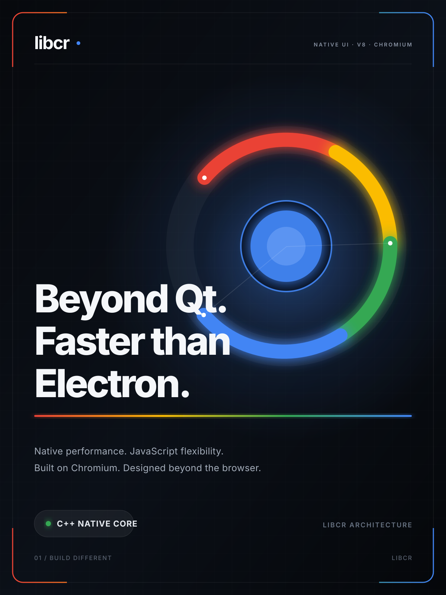
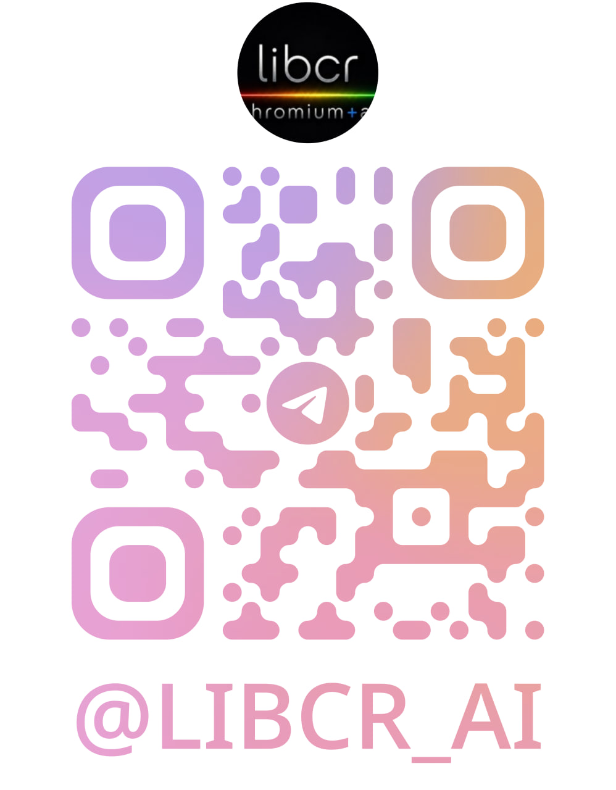
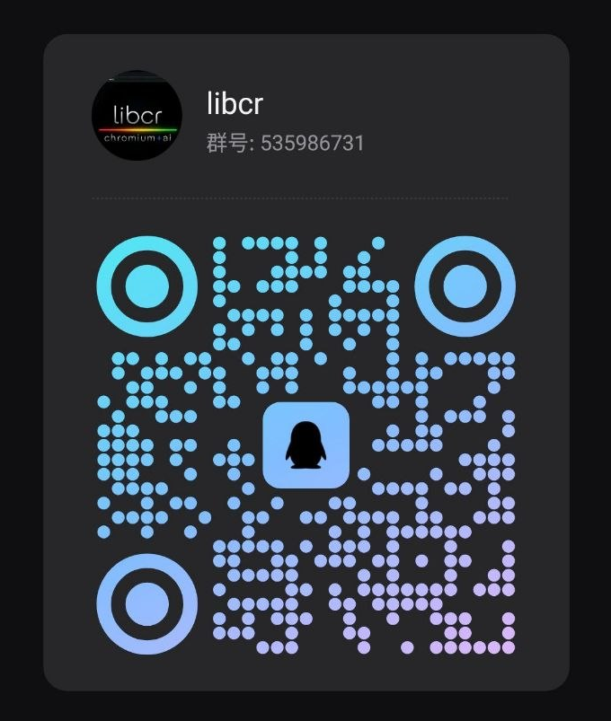

### libcr, powered by AI + Chromium

We use libcr to build fast, secure, and cross-platform desktop applications in modern C++,
using Chromium's production-grade platform technologies without Electron.

[**English**](README.md) | [简体中文](README.zh-CN.md)

[Explore our projects](https://github.com/orgs/libcr/repositories)

## What We Build

libcr develops focused desktop tools for Android device control, developers,
local file sharing, document workflows, and technical content. Our applications
combine native Chromium Views interfaces with selected Chromium components
such as the Network Service, Chromium Media, WebContents, and PDFium.

This approach gives our software the capabilities of the Chromium platform
while retaining native C++ performance, efficient system integration, and
fine-grained control over application architecture.

## Our Technical Advantages

- **Native C++ performance** — our applications are built as native Chromium
  targets, with no Electron or JavaScript desktop runtime layer.
- **Chromium-grade foundations** — we build on proven components including
  Chromium Views, Network Service, WebContents, Mojo, and PDFium.
- **Modern protocol support** — Chromium's networking stack provides mature
  HTTP/1.1, HTTP/2, HTTP/3, QUIC, TLS, and authentication capabilities.
- **Responsive large-file workflows** — background processing, streaming data
  pipelines, worker-based parsing, and virtualized rendering keep interfaces
  responsive.
- **Security by design** — restricted renderers, content sanitization, local
  resource controls, and Chromium's process architecture help reduce the
  attack surface.
- **Cross-platform architecture** — a shared Chromium and C++ foundation
  enables consistent behavior and native desktop integration across supported
  operating systems.
- **International-ready interfaces** — our applications include localized
  resources for a growing range of languages and regions.

## Our Applications

### crScrcpy

A free desktop application for displaying and controlling Android devices.
crScrcpy combines scrcpy's Android-side streaming capabilities with a native
Chromium Views interface and Chromium 150 media pipeline for responsive
single-device and multi-device workflows.

Highlights include:

- H.264/H.265 screen mirroring with automatic codec selection and hardware
  decoding when available
- Android audio forwarding through Chromium's low-latency audio infrastructure
- Multiple simultaneous device sessions and persistent, color-coded device
  groups
- Synchronized touch, mouse, keyboard, text, and clipboard input across a group
- Physical-display and virtual-desktop modes with configurable resolution,
  frame rate, and bit rate
- Direct-to-MP4 H.264/H.265 recording with optional Opus audio and no video
  re-encoding

**[View crScrcpy on GitHub](https://github.com/libcr/crScrcpy)** ·
**[Download releases](https://github.com/libcr/crScrcpy/releases)**

---

### crRequest

A fast, native developer workspace for API testing, remote access, and database
operations. crRequest brings HTTP request authoring, cURL synchronization,
protocol diagnostics, SSH/SFTP, SQLite, and PostgreSQL tools together in one
Chromium-powered desktop application.

Highlights include:

- HTTP/HTTPS requests with HTTP/1.1, HTTP/2, and strict HTTP/3 (QUIC) modes
- Request parameters, headers, bodies, Basic/Digest authentication, and
  environments
- Bidirectional synchronization between the visual request editor and cURL
- Request history, collections, protocol negotiation, ALPN, and error details
- SSH sessions, SFTP file management, and SQLite/PostgreSQL query tools

**[View crRequest on GitHub](https://github.com/libcr/crRequest)** ·
**[Download releases](https://github.com/libcr/crRequest/releases)**

---

### crPDF

A lightweight PDF reader and annotation application built with Chromium Views
and PDFium. crPDF provides fast local document rendering, practical annotation
tools, form support, document security, and offline digital-signature workflows
in a clean native desktop interface.

Highlights include:

- Continuous and dual-page reading, thumbnails, search, zoom, and rotation
- Highlight, underline, squiggly, strikethrough, note, FreeText, and stamp
  annotations
- AcroForm filling for common field types
- AES-256 password protection and PDF permission safeguards
- Offline digital-signature verification and visible signature creation

**[View crPDF on GitHub](https://github.com/libcr/crpdf)** ·
**[Get crPDF from the Microsoft Store](https://apps.microsoft.com/detail/9nmsj50f8m88?ocid=webpdpshare)** ·
**[Download releases](https://github.com/libcr/crpdf/releases)**

---

### crMarkdown

A fast Markdown viewer built with Chromium Views and a restricted WebContents
renderer. crMarkdown is designed for smooth navigation of technical documents,
including large files, without requiring Electron.

Highlights include:

- GitHub Flavored Markdown and locally bundled KaTeX mathematics
- Large-document streaming, background parsing, and DOM virtualization
- Full-document search, heading outline, directory browser, and bookmarks
- Multiple document and application themes
- Sanitized rendering and constrained access to local image resources

**[View crMarkdown on GitHub](https://github.com/libcr/crMarkdown)** ·
**[Get crMarkdown from the Microsoft Store](https://apps.microsoft.com/store/detail/9NRV9GT24X6J?cid=DevShareMCLPCS)** ·
**[Download releases](https://github.com/libcr/crMarkdown/releases)**

---

### crShare

A lightweight desktop application for sharing files, text, links, and images
across a local network. Built with native C++ and Chromium Views, crShare turns
selected folders into a clean browser-based sharing space that other devices
can use without installing a client application.

Highlights include:

- Multiple shared folders with custom display names, ordering, and independent
  upload permissions, with changes applied to connected pages in real time
- Browser-based folder navigation, sorting, streaming downloads, drag-and-drop
  uploads, live progress, and support for files up to 16 GiB
- Topic-based Quick Share for real-time sharing of text, links, pasted images,
  and dropped files over WebSocket
- Optional access-code authentication, 30-day remembered devices, integrated QR
  codes, and HTTPS backed by a persistent local certificate authority
- Searchable transfer history with retention controls, privacy mode, transfer
  details, and CSV export
- Isolated HTTP server process, multilingual native and web interfaces, and
  native light, dark, and system themes

**[View crShare on GitHub](https://github.com/libcr/crShare)** ·
**[Get crShare from the Microsoft Store](https://apps.microsoft.com/store/detail/9MWSSWF3H9LC?cid=DevShareMCLPCS)** ·
**[Download releases](https://github.com/libcr/crShare/releases)**

## Contact Us

Follow libcr, discuss our projects, share feedback, and connect with the
community through Telegram or QQ.

<table>
  <tr>
    <th>Telegram</th>
    <th>QQ Group</th>
  </tr>
  <tr>
    <td align="center">
      
    </td>
    <td align="center">
      
    </td>
  </tr>
  <tr>
    <td align="center"><a href="https://t.me/LIBCR_AI"><strong>@LIBCR_AI</strong></a></td>
    <td align="center"><strong>535986731</strong></td>
  </tr>
</table>

## Open Source

We believe focused native applications can be both powerful and approachable.
Explore the source, try the latest releases, report an issue, or contribute to
the projects that interest you.

**Built with C++, Chromium, and a commitment to excellent desktop software.**

