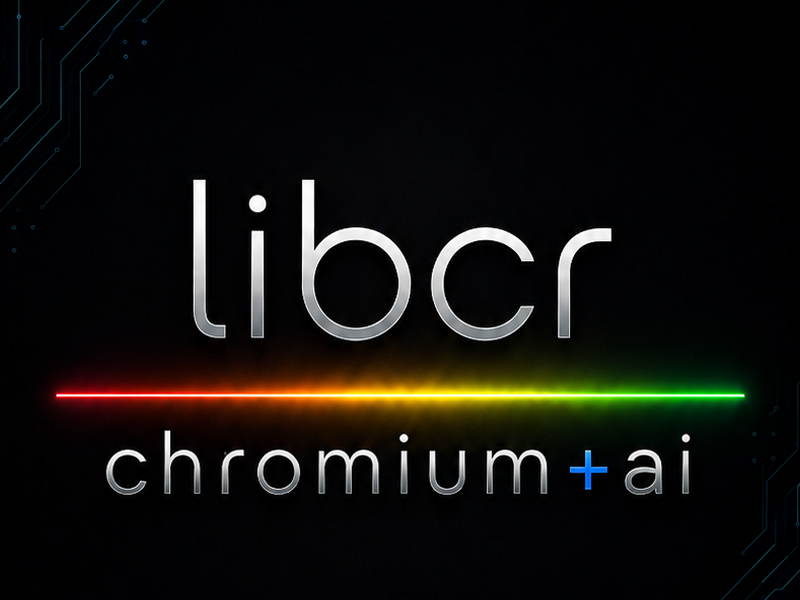

### 基于 Chromium，打造原生桌面软件

我们使用现代 C++ 与 Chromium 经过大规模实践验证的平台技术，
开发快速、安全、跨平台且无需 Electron 的原生桌面应用。

[English](README.md) | [**简体中文**](README.zh-CN.md)

[浏览我们的项目](https://github.com/orgs/libcr/repositories)

## 我们在做什么

libcr 专注于开发面向 Android 设备控制、开发者、文档工作流和技术内容的桌面工具。
我们的应用将 Chromium Views 原生界面与 Network Service、Chromium Media、
WebContents、PDFium 等经过选择的 Chromium 组件相结合。

这种技术路线既能充分利用 Chromium 平台的强大能力，又能保持原生 C++ 的性能、
高效的系统集成，以及对应用架构各个层面的精细控制。

## 我们的技术优势

- **原生 C++ 性能** —— 应用直接作为 Chromium 原生构建目标开发，
  无需 Electron 或额外的 JavaScript 桌面运行时。
- **Chromium 级技术基础** —— 基于 Chromium Views、Network Service、
  WebContents、Mojo 和 PDFium 等经过实践验证的核心组件。
- **现代网络协议支持** —— 借助 Chromium 成熟的网络栈，支持 HTTP/1.1、
  HTTP/2、HTTP/3、QUIC、TLS 和多种身份认证能力。
- **流畅的大文件处理** —— 通过后台处理、流式数据管线、Worker 解析和
  虚拟化渲染，让应用在处理大型文件时依然保持响应。
- **安全优先的设计** —— 使用受限渲染器、内容净化、本地资源访问控制和
  Chromium 多进程架构，帮助缩小潜在攻击面。
- **跨平台架构** —— 共享的 Chromium 与 C++ 技术基础，使应用能够在支持的
  操作系统上保持一致体验并实现原生桌面集成。
- **面向国际用户** —— 应用已提供多种语言和地区的本地化资源，并在持续扩展。

## 我们的应用

### crScrcpy

一款用于显示和控制 Android 设备的免费桌面应用。crScrcpy 将 scrcpy 在 Android
端的流媒体能力，与基于 Chromium Views 的原生界面和 Chromium 150 媒体管线相结合，
为单设备及多设备工作流提供流畅、灵敏的操作体验。

主要功能：

- 支持 H.264/H.265 屏幕镜像、自动编解码器选择，并在可用时启用硬件解码
- 通过 Chromium 低延迟音频基础设施转发 Android 音频
- 支持多个设备会话同时运行，以及持久化、可自定义颜色的设备分组
- 可在设备组内同步触摸、鼠标、键盘、文本和剪贴板操作
- 支持实体屏幕与虚拟桌面模式，并可配置分辨率、帧率和码率
- 将 H.264/H.265 视频直接录制为 MP4，可包含 Opus 音频，无需重新编码视频

**[在 GitHub 上查看 crScrcpy](https://github.com/libcr/crScrcpy)** ·
**[下载发行版本](https://github.com/libcr/crScrcpy/releases)**

---

### crRequest

一款快速、原生的开发者工作台，集 API 测试、远程访问和数据库操作于一体。
crRequest 将 HTTP 请求编辑、cURL 双向同步、协议诊断、SSH/SFTP、SQLite 和
PostgreSQL 工具整合在一个由 Chromium 驱动的桌面应用中。

主要功能：

- 支持 HTTP/1.1、HTTP/2 和严格 HTTP/3（QUIC）模式的 HTTP/HTTPS 请求
- 支持请求参数、请求头、请求正文、Basic/Digest 认证和环境变量
- 可视化请求编辑器与 cURL 双向同步
- 提供请求历史、Collection、协议协商、ALPN 和错误详情
- 集成 SSH 会话、SFTP 文件管理以及 SQLite/PostgreSQL 查询工具

**[在 GitHub 上查看 crRequest](https://github.com/libcr/crRequest)** ·
**[下载发行版本](https://github.com/libcr/crRequest/releases)**

---

### crPDF

一款使用 Chromium Views 和 PDFium 构建的轻量级 PDF 阅读与批注应用。
crPDF 在简洁的原生桌面界面中提供快速的本地文档渲染、实用的批注工具、
表单支持、文档安全功能，以及离线数字签名工作流。

主要功能：

- 连续与双页阅读、页面缩略图、全文搜索、缩放和旋转
- 高亮、下划线、波浪线、删除线、文本注释、FreeText 和图章批注
- 支持常见字段类型的 AcroForm 表单填写
- AES-256 密码保护和 PDF 权限安全控制
- 离线数字签名验证和可视化签名创建

**[在 GitHub 上查看 crPDF](https://github.com/libcr/crpdf)** ·
**[从 Microsoft Store 获取 crPDF](https://apps.microsoft.com/detail/9nmsj50f8m88?ocid=webpdpshare)** ·
**[下载发行版本](https://github.com/libcr/crpdf/releases)**

---

### crMarkdown

一款使用 Chromium Views 和受限 WebContents 渲染器构建的快速 Markdown
阅读器。crMarkdown 专为流畅浏览技术文档而设计，即使面对大型文件也能高效处理，
并且无需 Electron。

主要功能：

- 支持 GitHub Flavored Markdown 和本地内置的 KaTeX 数学公式
- 大型文档流式传输、后台解析和 DOM 虚拟化
- 全文搜索、标题大纲、目录浏览器和书签
- 多种文档主题与应用界面主题
- 净化后的安全渲染，以及受约束的本地图片资源访问

**[在 GitHub 上查看 crMarkdown](https://github.com/libcr/crMarkdown)** ·
**[从 Microsoft Store 获取 crMarkdown](https://apps.microsoft.com/store/detail/9NRV9GT24X6J?cid=DevShareMCLPCS)** ·
**[下载发行版本](https://github.com/libcr/crMarkdown/releases)**

## 开源

我们相信，专注的原生应用可以同时具备强大能力与出色的易用性。欢迎浏览源代码、
体验最新发行版本、提交问题，或参与任何你感兴趣的项目。

**使用 C++ 与 Chromium 构建，专注于打造优秀的桌面软件。**

